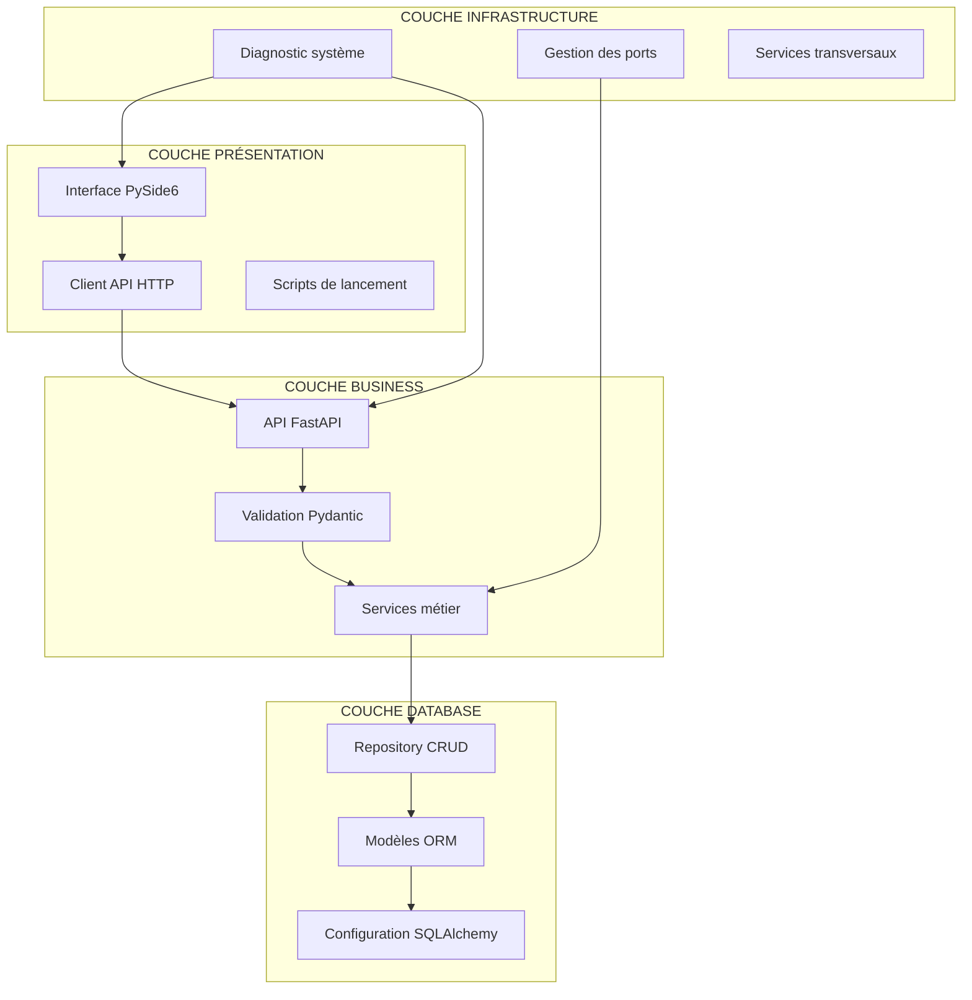
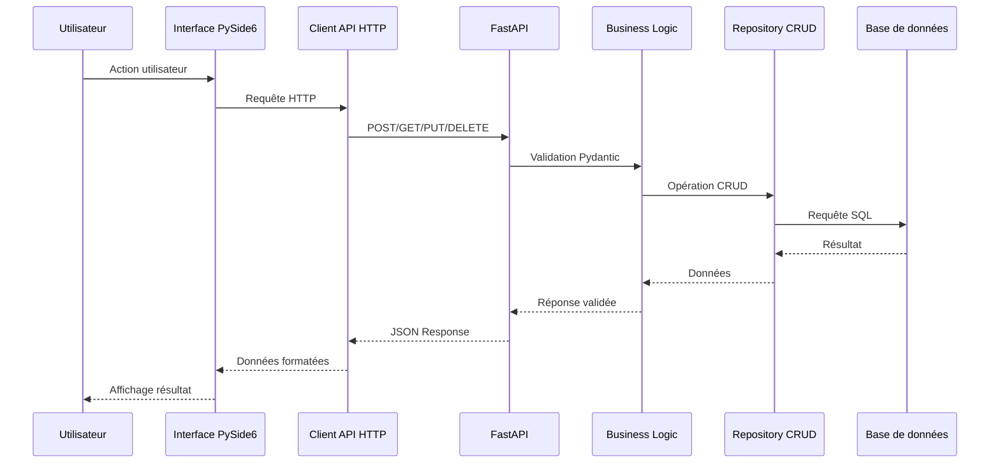
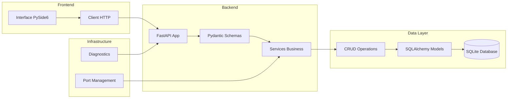
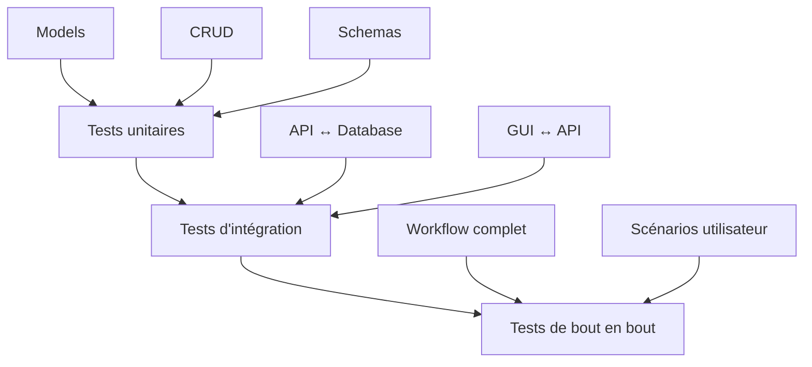

# Architecture FastAPI CRUD - Documentation Technique

## Table des Matières

1. [Vue d'ensemble du projet](#vue-densemble-du-projet)
2. [Architecture en couches](#architecture-en-couches)
3. [Structure des répertoires](#structure-des-répertoires)
4. [Flux de données](#flux-de-données)
5. [Composants techniques](#composants-techniques)
6. [Scripts d'entrée](#scripts-dentrée)
7. [Configuration et déploiement](#configuration-et-déploiement)
8. [Tests et validation](#tests-et-validation)
9. [Migration depuis l'ancienne structure](#migration-depuis-lancienne-structure)
10. [Guide de démarrage](#guide-de-démarrage)

---

## Vue d'ensemble du projet

Ce projet implémente une API CRUD complète développée avec FastAPI, organisée selon une architecture en couches pour assurer la maintenabilité, l'évolutivité et la testabilité du code.

### Fonctionnalités principales

- API REST complète avec opérations CRUD
- Interface graphique PySide6 pour la gestion des données
- Base de données SQLite avec SQLAlchemy ORM
- Validation automatique des données avec Pydantic
- Documentation automatique Swagger/OpenAPI
- Système de diagnostic et gestion des ports
- Architecture modulaire en 4 couches distinctes

---

## Architecture en couches

Le projet suit une architecture 4-tiers qui sépare clairement les responsabilités :



### Responsabilités par couche

| Couche | Responsabilité | Technologies |
|--------|----------------|--------------|
| **Présentation** | Interface utilisateur et clients | PySide6, requests |
| **Business** | Logique métier et API | FastAPI, Pydantic, uvicorn |
| **Database** | Persistance et accès aux données | SQLAlchemy, SQLite |
| **Infrastructure** | Services transversaux et monitoring | psutil, scripts système |

---

## Structure des répertoires

```
Fastapi-01-projet-03/
├── presentation/
│   ├── gui/
│   │   ├── __init__.py
│   │   ├── api_client.py
│   │   └── main_window.py
│   └── launchers/
│       └── run_gui.py
│
├── business/
│   ├── api/
│   │   └── main.py
│   ├── validation/
│   │   └── schemas.py
│   └── services/
│       └── safe_start.py
│
├── database/
│   ├── config/
│   │   └── database.py
│   ├── models/
│   │   └── models.py
│   └── repository/
│       └── crud.py
│
├── infrastructure/
│   └── diagnostics/
│       └── check_ports.py
│
├── config/
│   ├── requirements.txt
│   ├── setup.bat
│   └── setup.sh
│
├── tests/
│   ├── test_coherence.py
│   ├── test_gui_integration.py
│   └── api_tests.http
│
├── examples/
│   ├── exemple_utilisation.py
│   └── seed_data.py
│
├── database_files/
│   ├── test.db
│   └── README.md
│
├── legacy/
│   └── [anciens fichiers dépréciés]
│
├── start_api.py
├── start_gui.py
├── check_system.py
└── ARCHITECTURE.md
```

---

## Flux de données

### Flux principal de l'application



### Architecture des composants



---

## Composants techniques

### Couche Présentation

**Interface graphique (presentation/gui/)**
- `main_window.py` : Fenêtre principale avec onglets utilisateurs/articles
- `api_client.py` : Client HTTP pour communication avec l'API
- Fonctionnalités : CRUD visuel, recherche, validation, indicateurs de statut

**Launchers (presentation/launchers/)**
- `run_gui.py` : Script de démarrage de l'interface graphique

### Couche Business

**API FastAPI (business/api/)**
- `main.py` : Endpoints REST avec documentation automatique
- Endpoints : `/users/`, `/items/`, `/search/items`
- Gestion des erreurs HTTP et codes de statut appropriés

**Validation (business/validation/)**
- `schemas.py` : Schémas Pydantic pour validation des données
- Types : UserCreate, UserUpdate, ItemCreate, ItemUpdate

**Services (business/services/)**
- `safe_start.py` : Service de démarrage sécurisé avec gestion des ports

### Couche Database

**Configuration (database/config/)**
- `database.py` : Configuration SQLAlchemy et session factory

**Modèles (database/models/)**
- `models.py` : Modèles ORM User et Item avec relations

**Repository (database/repository/)**
- `crud.py` : Opérations CRUD avec gestion des erreurs

### Couche Infrastructure

**Diagnostics (infrastructure/diagnostics/)**
- `check_ports.py` : Diagnostic système et gestion des ports
- Fonctionnalités : détection des processus, arrêt forcé, recherche de ports libres

---

## Scripts d'entrée

Le projet propose trois scripts principaux à la racine pour simplifier l'utilisation :

### start_api.py
```bash
python start_api.py [options]
```
Options disponibles :
- `--port 8000` : Port d'écoute
- `--host 0.0.0.0` : Adresse d'écoute
- `--auto-port` : Recherche automatique d'un port libre
- `--force-kill` : Arrêt forcé des processus conflictuels
- `--no-reload` : Désactivation du rechargement automatique

### start_gui.py
```bash
python start_gui.py
```
Lance l'interface graphique PySide6 avec connexion automatique à l'API.

### check_system.py
```bash
python check_system.py [options]
```
Options disponibles :
- `--kill-port PORT` : Arrêter le processus sur un port spécifique
- `--kill-all-python` : Arrêter tous les processus Python
- `--show-commands` : Afficher les commandes utiles

---

## Configuration et déploiement

### Dépendances

Les dépendances sont organisées par couche dans `config/requirements.txt` :

```
# Core FastAPI
fastapi==0.104.1
uvicorn[standard]==0.24.0

# Database
sqlalchemy==2.0.23
sqlite3  # Built-in Python

# Validation
pydantic==2.5.0

# GUI
PySide6==6.6.1
requests==2.31.0

# System monitoring
psutil==5.9.6
```

### Scripts de configuration

**Windows (config/setup.bat)**
```batch
python -m venv venv
venv\Scripts\activate
pip install -r config/requirements.txt
```

**Unix/Linux (config/setup.sh)**
```bash
python3 -m venv venv
source venv/bin/activate
pip install -r config/requirements.txt
```

### Variables d'environnement

```bash
# Base de données
DATABASE_URL=sqlite:///./database_files/test.db

# API
API_HOST=0.0.0.0
API_PORT=8000

# Interface
GUI_API_URL=http://localhost:8000
```

---

## Tests et validation

### Types de tests

**Tests de cohérence (tests/test_coherence.py)**
- Validation de l'ordre logique des opérations
- Vérification de l'intégrité des relations
- Tests de validation Pydantic

**Tests d'intégration GUI (tests/test_gui_integration.py)**
- Communication GUI ↔ API
- Validation de l'interface utilisateur
- Tests de bout en bout

**Tests API REST (tests/api_tests.http)**
- Tests chronologiques des endpoints
- Validation des codes de statut HTTP
- Tests de cas d'erreur

### Stratégie de test



---

## Migration depuis l'ancienne structure

### Mapping des fichiers

| Ancien fichier | Nouveau chemin | Statut |
|----------------|----------------|---------|
| `main.py` | `business/api/main.py` | Migré |
| `models.py` | `database/models/models.py` | Migré |
| `crud.py` | `database/repository/crud.py` | Migré |
| `schemas.py` | `business/validation/schemas.py` | Migré |
| `database.py` | `database/config/database.py` | Migré |
| `safe_start.py` | `business/services/safe_start.py` | Migré |
| `gui_client/` | `presentation/gui/` | Migré |
| `check_ports.py` | `infrastructure/diagnostics/check_ports.py` | Migré |

### Imports mis à jour

Les imports ont été automatiquement corrigés pour refléter la nouvelle structure :

```python
# Ancien
from database import SessionLocal, engine
import models, schemas, crud

# Nouveau
from database.config.database import SessionLocal, engine
from database.models import models
from business.validation import schemas
from database.repository import crud
```

---

## Guide de démarrage

### Installation rapide

```bash
# 1. Configuration automatique
python config/setup.bat  # Windows
./config/setup.sh        # Unix/Linux

# 2. Activation de l'environnement virtuel
# Windows
venv\Scripts\activate
# Unix/Linux
source venv/bin/activate

# 3. Démarrage de l'API
python start_api.py

# 4. Démarrage de l'interface (terminal séparé)
python start_gui.py
```

### Utilisation avancée

```bash
# Diagnostic système
python check_system.py

# Démarrage avec port automatique
python start_api.py --auto-port

# Démarrage avec arrêt forcé des conflits
python start_api.py --force-kill

# Ajout de données d'exemple
python examples/seed_data.py add

# Tests de validation
python tests/test_coherence.py
```

### Accès aux services

- **API REST** : http://localhost:8000
- **Documentation Swagger** : http://localhost:8000/docs
- **Documentation ReDoc** : http://localhost:8000/redoc
- **Interface graphique** : Lancée automatiquement par `start_gui.py`

### Dépannage courant

**Port déjà utilisé**
```bash
python check_system.py --kill-port 8000
python start_api.py --auto-port
```

**Erreurs d'imports**
```bash
pip install -r config/requirements.txt
```

**Base de données corrompue**
```bash
rm database_files/test.db
python start_api.py  # Recréera automatiquement la base
```

---

## Conclusion

Cette architecture en couches offre une base solide pour le développement, la maintenance et l'évolution du projet FastAPI CRUD. La séparation claire des responsabilités, les scripts d'entrée simplifiés et la documentation complète facilitent l'onboarding des nouveaux développeurs et la collaboration en équipe.

La structure modulaire permet également une migration future vers des architectures plus complexes (microservices, conteneurisation Docker, déploiement cloud) sans refactoring majeur du code existant.
